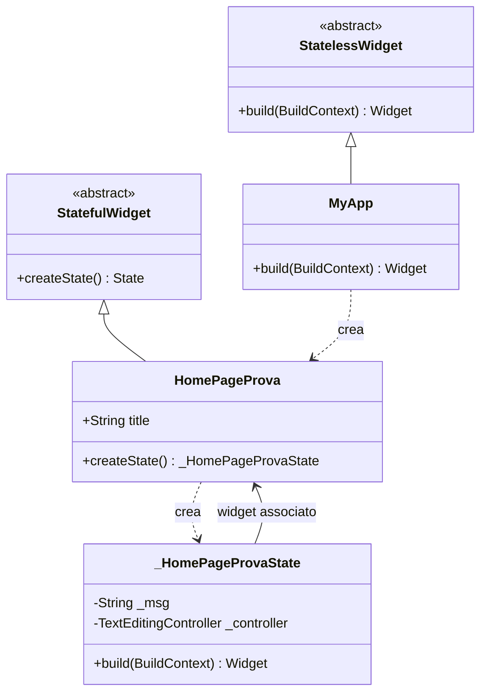
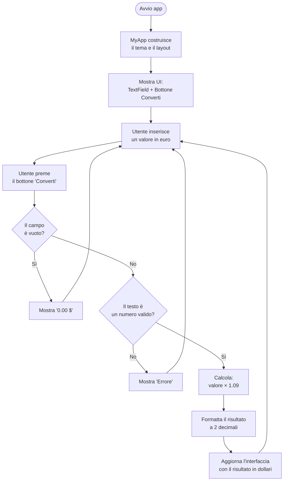

# Convertitore Euro → Dollari

App Flutter che converte un importo in euro nel corrispondente valore in dollari, usando un tasso di cambio fisso (1 € = 1.09 $).

## Descrizione

L'app mostra un campo di testo in cui l'utente inserisce una cifra in euro. Premendo il bottone "Converti", il valore viene moltiplicato per 1.09 e il risultato in dollari viene visualizzato a schermo. Gestisce input non validi e campi vuoti.

---

## Struttura delle classi

Il progetto è composto da tre classi principali in `lib/main.dart`:

| Classe | Tipo | Responsabilità |
|--------|------|----------------|
| `MyApp` | `StatelessWidget` | Widget radice: configura il tema e lancia `HomePageProva` |
| `HomePageProva` | `StatefulWidget` | Widget della schermata principale, mantiene il titolo |
| `_HomePageProvaState` | `State<HomePageProva>` | Gestisce lo stato: input, validazione e calcolo della conversione |

---

## Diagramma delle Classi (UML)



---

## Diagramma delle Attività (UML)



---

## Come eseguire

```bash
flutter pub get
flutter run
```

Richiede Flutter SDK installato. Compatibile con Android, iOS, macOS e Linux.

---

## Note tecniche

- La conversione gestisce sia la virgola che il punto come separatore decimale (`replaceAll(',', '.')`)
- Il tasso di cambio è fisso: **1 € = 1.09 $**
- L'aggiornamento dell'interfaccia avviene tramite `setState()` che forza il rebuild del widget
- Il `TextEditingController` permette di leggere il contenuto del `TextField` dall'handler del bottone
